# ANDROID-Purchase

Приложение создано для китайских поставщиков.
Раньше они присылали набор фотографий с ценами в которых легко запутаться. Не понятно заказывали мы такой товар или нет. 

Чтобы решить эту проблему создали приложение, которые позволяет фографировать новый товар на складе и в самом приложении ставить метку на каждой позии.
На одной фотографии могут быть несколько товаров, где на каждом товаре поставщик ставит метку. После набор нового товара отправляется в базу 1С.

Далее мы делаем заказ по новому товару либо уже заказаному в прошлом. Каждый товар теперь имеет фотку и метку.
Поставщик получит заказ на сборку с фотографиями, которые он делал раньше.

Теперь путаницы нет.

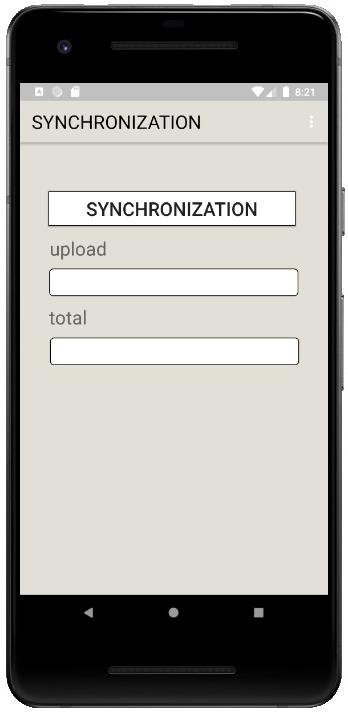
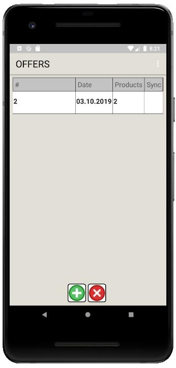
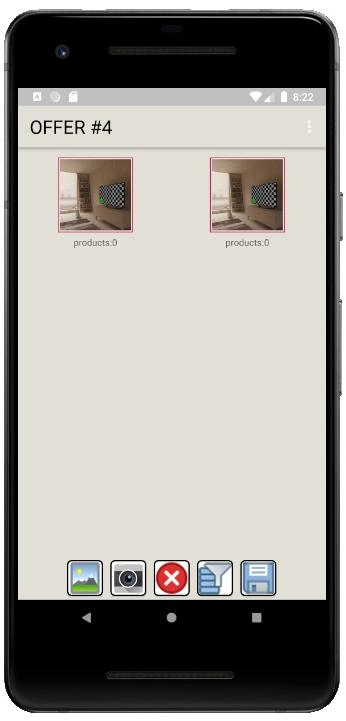
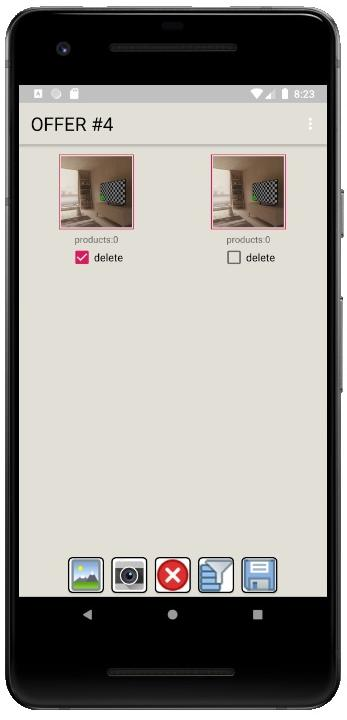
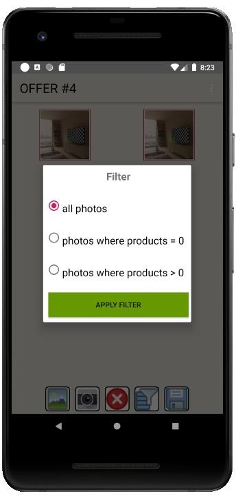
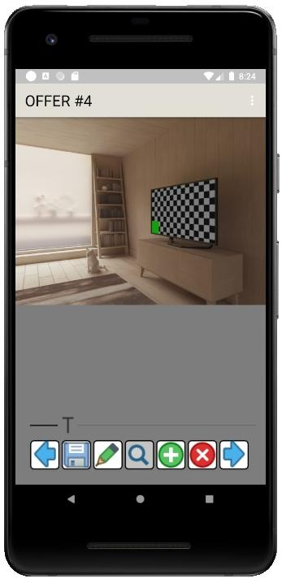
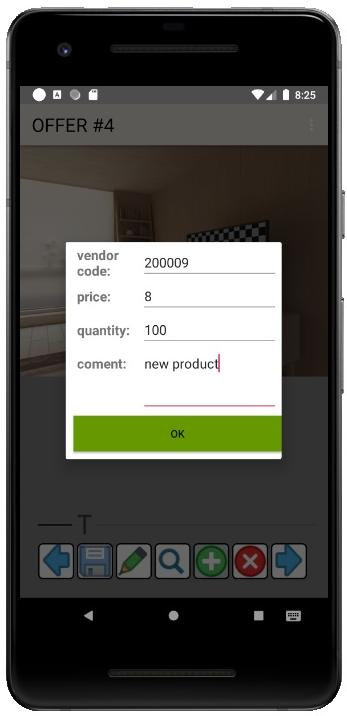
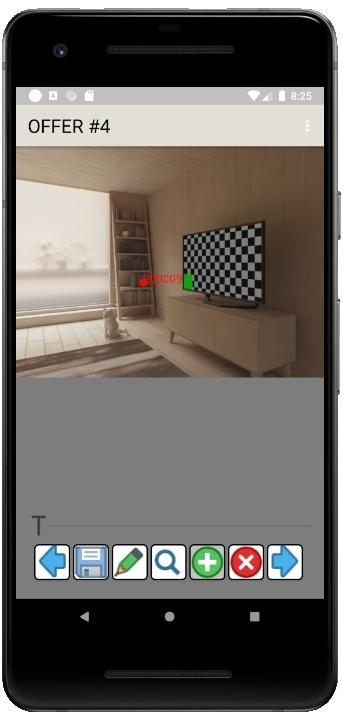
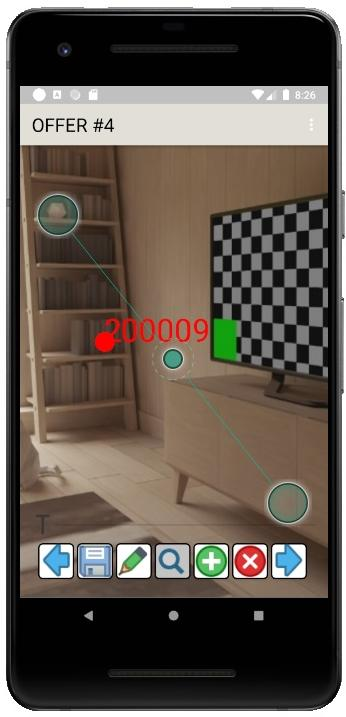
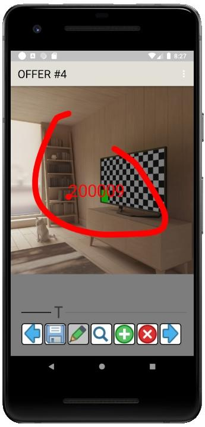
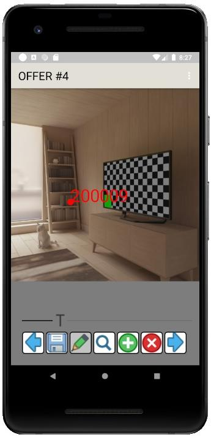
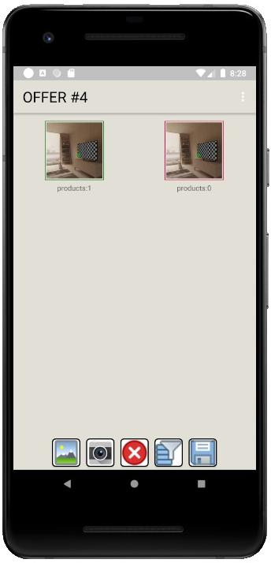
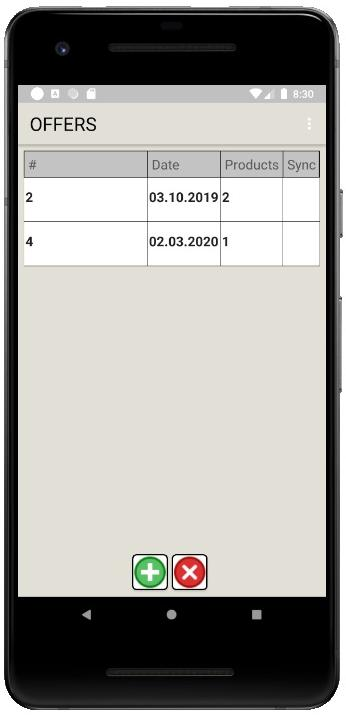
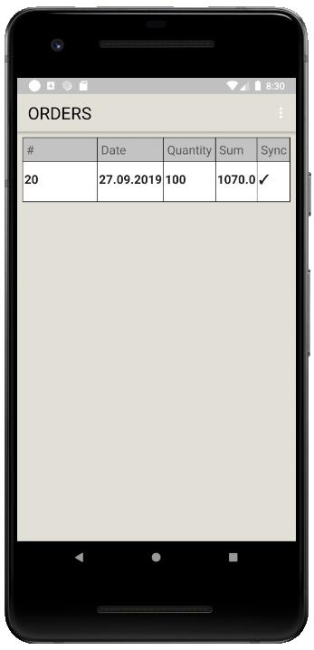
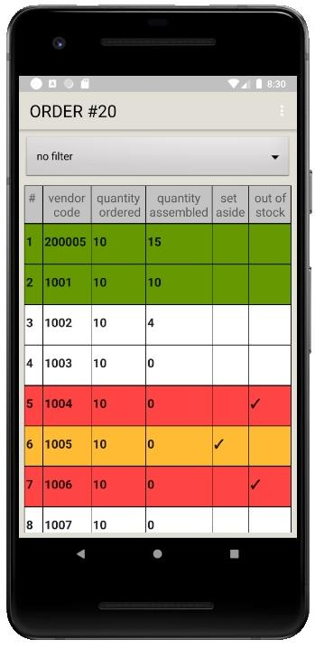
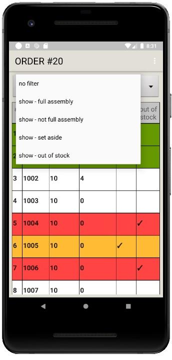
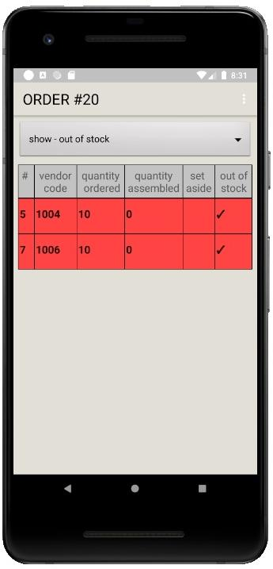
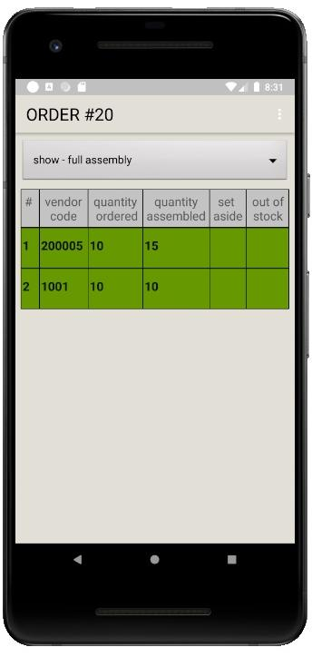
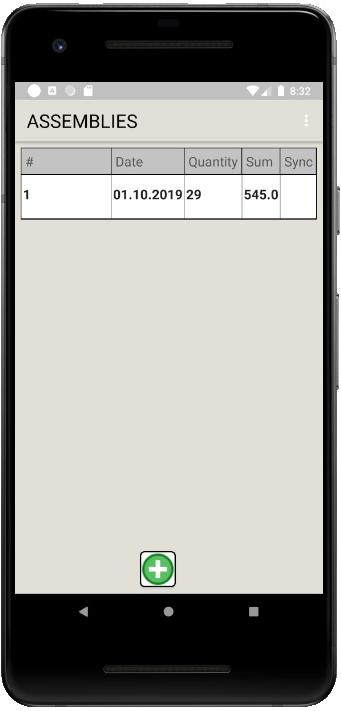
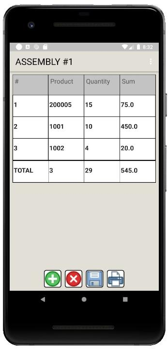
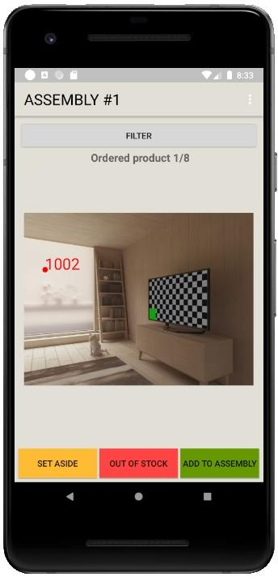
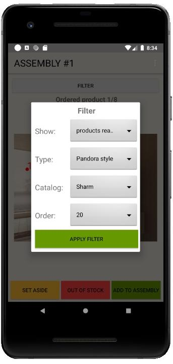
